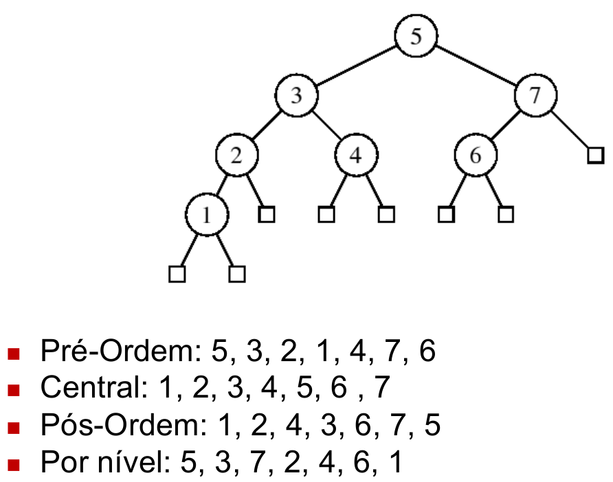

# Estrutura de Dados -  Árvores 

#### Sumário:
* [Árvores](#árvores)
  * [Aspectos](#aspectos%3A)
  * [Caminho](#caminho%3A)
  * [Medidas](#medidas%3A)
    * [Árvore Binária Balanceada](#árvore-binária-balanceada%3A)

* [Percorrendo Árvores](#percorrendo-árvores)

* [Tipos de Árvores](#tipos-de-árvores)
    * [Árvore de Huffman](#árvore-de-huffman)
 

## Árvores

### Aspectos:
* Organização não linear de dados.
* Organiza os dados  em estrutura em hierárquica.
* Um único nó é uma árvore. Este nó é a raiz da árvore.
* Nível do nó raíz é 0.
* Nós que não possuem filhos são chamados de folhas.
* **Árvore Binária: Máximo dois filhos.**

### Operações:
* Criar árvore
* Inserção
* Retirada
* Pesquisa
* Caminhamento
* Impressão

#### Soma e operações com valores da árvore:
A maior parte das operações que se realiza com valores dos nós de uma árvore como função, são baseados no algoritmo/função de soma:

~~~
int soma(Ponteiro nó){
  if(no!=NULL){
    return nó->valor + soma(no->Esquerda) + soma(no->Direita);
  }
  return 0;
}
~~~

### Caminho:
* Ordem de seus filhos pode ou não ser significativa.
* Caminho (existe apenas um) que liga dois pontos (**Grafo sem ciclos**).
* Nível do nó é o comprimento do caminho deste nó até o nó raiz.
* Caso o caminho que esteja se medindo é de um nó antecedente a um nó decendente o caminho é negativo.

### Medidas:
* Ordem de seus filhos pode ou não ser significativa.
* Três medidas:
  1. Profundidade do nó: Comprimento do caminho do nó à raiz.
  2. Altura de um nó: Comprimento do caminho mais longo do nó até uma folha.
  3. Altura da árvore: Comprimento mais longo da raiz até uma das folhas.

* **Altura Máxima**: Quando cada nó da árvore só tem um filho. Altura máxima (n-1), sendo n o número de nós.
* **Altura mínima**: Quando a árvore está balanceada.

#### Árvore Binária Balanceada:
  * Quatidade de nós por nível:
    * Nvl 0: 2⁰
    * Nvl 1: 2¹
    * ...
    * Nvl k: (2 $\exp$ k)
  * Quantidade de nós no Total:
    * Sendo 'n' o número total de nós e 'k' a altura tem-se:  $\sum$ (2 $\exp$ i)
    * Então n = (2 $\exp$ (k+1)) - 1
  * A partir do total de nós pode-se saber a altura da árvore:
    * k = log(n+1) - 1 

 

## Percorrendo Árvores

Algotimos para caminhar em ávores são em sua grande maioria **recursivos**.
* **Tipos mais comuns:**
  * Caminhamento em profundidade:
    * Pré-odem (Pré-fixada)
    * In-ordem (Central ou Fixada)
    * Pós-ordem (Pós-fixada)
  * Caminhamento por nível.

#### Pré-Ordem:
A cada nó que passa imprime: Prioriza indo para o lado esquerdo, 
caso não tenha mais nós no lado esquerdo ele volta de um em um procurando algum nó que já passou com um filho à direita, 
caso ache ele pula para esse nó, o imprime e testa novamente a esquerda e só se não consegui volta a tentar a direita.**Imprimi-se na ida**.

#### Pós-Ordem:
Vai listando todas as sub-árvores da seguinte forma: Busca a sub-árvore á esquerda do nó, quando termina busca a sub-árvore à direita, quando termina imprime o nó pai de ambas sub-árvores.**Imprimi-se na volta**.

#### In-Ordem/Central:
Muito parecido com o anterior, a diferença é que após listar as sub-árvores á esquerda, em seguida já imprimi-se o nó pai, só então busca-se a sub-árvore à direita. **Imprime na volta e na passagem pelo pai**.

#### Por nível:
Imprimi-se os nós por nível de forma crescente e da esquerda para a direita

 

### Árvore Binária de Pesquisa
### HEAP
### Árvore de Huffman:
Usada para comprimir arquivos. 
Utiliza de uma árvore binária para gerar novos números que representam valores, esses novos números seram menores que os representantes padrões, dessa forma o valor final de memória ocupada é menor. 

**Exemplo:** 
Imagine que temos um texto AAARRDDBB!C, cada caracter desse é representado na tabela ASCll e acessado com 8bits/1byte. 
Ou seja podemos construir uma outra representação, ou seja novos valores com menos bits para representar cada Caracter.i 
Montamos uma árvore, com as arestas para a direita e esquerda representadas por bits 1-0. 
Outro fator importante para otimizar a compressão de arquivo é colocando os elementos mais recorrentes em camadas superiores, diminuindo ainda mais o tamnho de suas representações. 
A imagem abaixo representa esse exemplo.

