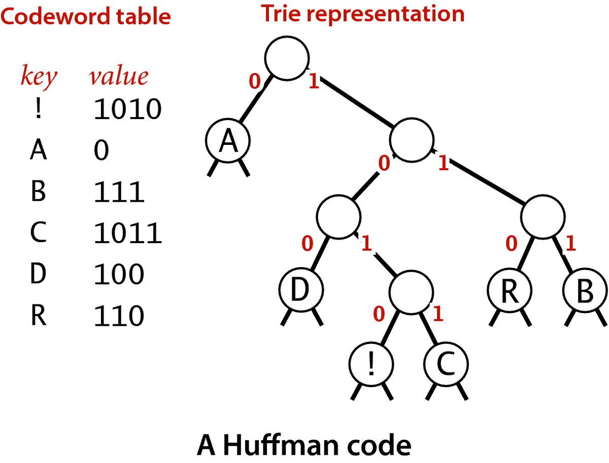

# Estrutura de Dados -  Árvores 

#### Sumário:
1. [Árvores](#árvores)
  * [Aspectos](#aspectos%3A)
  * [Caminho](#caminho%3A)
  * [Medidas](#medidas%3A)
    * [Árvore Binária Balanceada](#árvore-binária-balanceadai%3A)

2. [Tipos de Árvores](#tipos-de-árvores)
 

## Árvores

### Aspectos:
* Organização não linear de dados.
* Organiza os dados  em estrutura em hierárquica.
* Um único nó é uma árvore. Este nó é a raiz da árvore.
* Nível do nó raíz é 0.
* Nós que não possuem filhos são chamados de folhas.
* **Árvore Binária: Máximo dois filhos.**

### Caminho:
* Ordem de seus filhos pode ou não ser significativa.
* Caminho (existe apenas um) que liga dois pontos (**Grado sem ciclos**).
* Nível do nó é o comprimento do caminho deste nó até o nó raiz.
* Caso o caminho que esteja se medindo é de um nó antecedente a um nó decendente o caminho é negativo.

### Medidas:
* Ordem de seus filhos pode ou não ser significativa.
* Três medidas:
  1. Profundidade do nó: Comprimento do caminho do nó à raiz.
  2. Altura de um nó: Comprimento do caminho mais longo do nó até uma folha.
  3. Altura da árvore: Comprimento mais longo da raiz até uma das folhas.

* **Altura Máxima**: Quando cada nó da árvore só tem um filho. Altura máxima (n-1), sendo n o número de nós.
* **Altura mínima**: Quando a árvore está balanceada.

#### Árvore Binária Balanceada:
  * Quatidade de nós por nível:
    * Nvl 0: 2⁰
    * Nvl 1: 2¹
    * ...
    * Nvl k: (2 $\exp$ k)
  * Quantidade de nós no Total:
    * Sendo 'n' o número total de nós e 'k' a altura tem-se:  $\sum$ (2 $\exp$ i)
    * Então n = (2 $\exp$ (k+1)) - 1
  * A partir do total de nós pode-se saber a altura da árvore:
    * k = log(n+1) - 1 

 

### Árvore de Huffman:
Usada para comprimir arquivos. 
Utiliza de uma árvore binária para gerar novos números que representam valores, esses novos números seram menores que os representantes padrões, dessa forma o valor final de memória ocupada é menor. 

**Exemplo:** 
Imagine que temos um texto AAARRDDBB!C, cada caracter desse é representado na tabela ASCll e acessado com 8bits/1byte. 
Ou seja podemos construir uma outra representação, ou seja novos valores com menos bits para representar cada Caracter.i 
Montamos uma árvore, com as arestas para a direita e esquerda representadas por bits 1-0. 
Outro fator importante para otimizar a compressão de arquivo é colocando os elementos mais recorrentes em camadas superiores, diminuindo ainda mais o tamnho de suas representações. 
A imagem abaixo representa esse exemplo.

